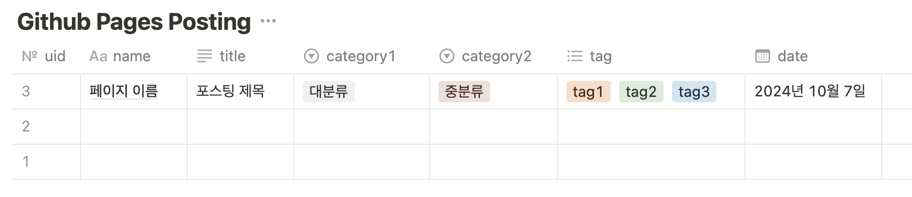

# Notion2Chirpy

Notion2Chirpy는 Notion 페이지를 markdown 형태로 다운로드 받아 Jekyll 기반의 Github Pages(Chirpy 테마)에 업로드(포스팅)하는 것을 자동화한다.

## Features

1. Notion Page markdown 형태로 다운받기
2. Notion 마크다운을 chirpy 포맷에 맞게 변환
    - notion table 컬럼 -> front matter (title, date, tags, category, uid)
    - markdown 파일명 -> notion page의 uid로 변경 (yyyy-mm-dd-uid.md)
    - 이미지 파일 -> imgur url image (repository 저장 공간 확보)
    - callout 블록 -> .prompt-tip 으로 변환
3. github pages 로컬 저장소 경로 _posts 폴더에 저장 (optional)
4. github remote 저장소에 commit & push (optional)
5. notion 해당 페이지 status를 `발행완료`로 수정

## 사용방법

### 1. config.yaml 파일 설정

- `config.yaml` 파일을 열어서 Github Pages를 사용할 저장소의의 url, imgur/notion의 API 키와 토큰, notion database id 설정

```yaml
GITHUB:
  AUTO_COMMIT: True # True인 경우 자동으로 commit & push, False인 경우 로컬 저장소에 파일만 저장

  USERNAME: <YOUR_GITHUB_USERNAME>
  REPO_NAME: <YOUR_GITHUB_REPO_NAME>

  # below is used for AUTO_COMMIT is True
  BRANCH: <YOUR_BRANCH_NAME> # e.g. main
  TOKEN: <YOUR_GITHUB_TOKEN>

  # below is used for AUTO_COMMIT is False (optional)
  LOCAL_REPO_POST_DIR: # 로컬 저장소의 _posts 폴더 경로 (e.g. PATH/TO/YOUR/REPO/_posts)

IMGUR:
  CLIENT_ID: <YOUR_CLIENT_ID>

NOTION:
  DATABASE_ID: <YOUR_DATABASE_ID>
  API_KEY: <YOUR_API_KEY>
  TOKEN_V2: <YOUR_TOKEN_V2>
```

### 2. Notion Database 설정

- 업로드할 페이지가 저장되는 Notion Database를 생성하고 아래와 같은 컬럼을 생성한다.
- [예시 링크](https://jmjeon94.notion.site/Notion2Chirpy-Database-11848a6e55fc80d8b016e8e40db5ebf0?pvs=74)에 접속하여 해당 Notion
  페이지를 복제하여 사용할 수 있다.
- `name`, `status`, `category1`, `category2`, `tag`, `uid` 컬럼은 필수이다.



### 1. Docker 방식(Recommended)

- 도커가 설치되어있고 도커 기반 환경이 익숙한 경우, 아래 명령어로 도커 이미지를 빌드/실행하여 사용할 수 있다.

```bash
docker compose up
```

### 2. Python 실행 방식

- Python을 사용하는 경우, 아래와 같이 실행한다.

```bash
python main.py
```

### 동작 방식

- 실행 시, Notion 페이지의 status가 `발행 요청`인 페이지를 markdown 파일로 변환하여 Github Pages에 업로드한다.
- config.yaml 파일에서 `AUTO_COMMIT` 값이 `True` 인 경우 Github API를 통해 자동으로 commit & push를 수행한다.
- `AUTO_COMMIT` 값이 `False`인 경우, `.notion2md/_posts` 폴더에 변환된 md 파일들이 저장된다. 이 파일들을 github pages의 로컬 저장소 경로 `_posts` 폴더에
  수동으로 복사하여 commit & push 해야 한다.

```bash
# 수동 파일 복사 및 github 업로드 예시
cp -r .notion2md/_posts/*.html <USERNAME>.github.io/_posts
cd <USERNAME>.github.io
  
git add .
git commit -m "add posts"
git push
```

- `LOCAL_REPO_POST_DIR` 값을 설정하면 위의 작업을 자동화하여 로컬 저장소에 파일들을 바로 이동 할 수 있다. (커밋은 직접 수행해야 함)
- Github Pages에 업로드된 페이지는 `https://<USERNAME>.github.io/posts/<UID>`로 접속할 수 있다.

## 오류 발생시 Log 확인

- `logs` 폴더에 날짜별로 로그 파일이 생성된다.
- 오류 발생시 해당 로그 파일을 확인하여 원인을 파악할 수 있다.

## Todo Features

- [x] notion db uid를 page md파일명으로 변경(기존에는 복잡한 encoded string)
- [x] 카테고리 컬럼 두개로 분할
- [x] versioning 기능 추가
- [x] notion table 업데이트(발행 완료, URL 추가)
- [x] md 파일 내 http 링크는 자동으로 https로 변경
- [x] 성공 및 실패 알람(Alert) 만들기
- [x] 도커 이미지 생성
- [x] markdown 하단에 watermark 추가
- [x] github api로 commit&push(upload) 대체
- [x] 성공 페이지 URL 링크를 log에 추가 (바로 접근 가능하도록)
- [x] slack이나 email로 알람 기능 추가
- [ ] 발행 완료된 페이지가 실제로 배포 되었는지 여부 확인
- [ ] 게시물 수정시 기존 imgur 이미지 url 활용하기
- [ ] notion db의 컬럼과 md 파일의 front matter sync 맞추기
- [ ] imgur을 대체할 서비스 찾기(notion 웹 게시, S3 등)

이미지 관련

- [ ] 게시물 썸네일 이미지 적용 (첫번째 이미지를 썸네일로 사용)
- [ ] 썸네일 및 모든 이미지에 lqip 적용
- [ ] 이미지 사이즈 조절
- [ ] 이미지 정렬
- [ ] 이미지 caption 추가 (현재는 불가능)
- [ ] 글씨 색 및 배경색 추가 (현재는 불가능)
- [ ] (optional) 게시글 description 추가(썸네일)

## Bug Fixes

- [x] author 안보임 -> author를 front matter에서 삭제로 해결
- [x] TOC의 첫번째 헤더 인식이 안 됨 -> Default로 H2~H3까지만 인식하도록 되어 있음
- [x] 실제 이미지가 파일업로드가 아닌 다른 url 링크로 되어있는 경우 에러 발생함
- [x] log 파일이 날짜 이름으로 생성되지 않는 문제
- [x] 제목에 : 가 들어가면 제목으로 인식하지 못하는 문제
- [ ] table 형식이 깨짐 (value 내에 줄바꿈이 있는 경우)
